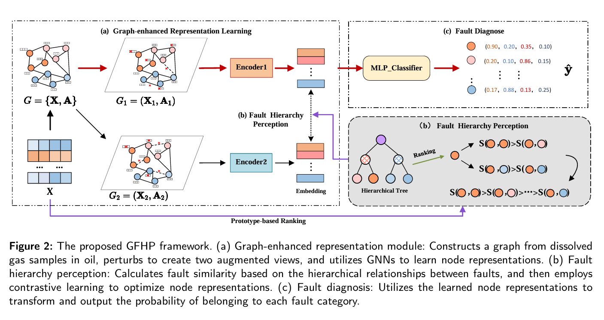

# CFHP

## Abstract
 Dissolved Gas Analysis (DGA) is a widely utilized technique for diagnosing faults in power
 transformers, whose purpose is to identify potential faults by monitoring the gas content in the
 transformer oil. However, existing research typically treats dissolved gas samples as independent
 entities, failing to effectively capture the underlying relationships and context. Besides, the sim
ilarities between faults caused by different factors may be higher than that between faults caused
 by the same factor, thus the hierarchical relationships between faults should be deliberately
 modeled to improve the predictive performance of fault diagnosis. In this work, we propose
 a Graph-enhanced Fault Hierarchical Perception Model for DGA. In our model, dissolved gases
 are represented as nodes, and the similarity between gases is calculated to construct a 𝐾NN
 (𝐾-Nearest Neighbors) graph, which captures potential associations between DGA samples. To
 provide different perspectives, we create two augmented views by randomly perturbing node
 features and edges. These augmented views help us learn and update representations of samples.
 Furthermore, we design a ranking strategy based on hierarchical perception to rank the similarity
 between faults in a fine-grained manner, effectively utilizing the hierarchical information of
 faults to optimize the model. To ensure consistent prediction results from the two augmented
 views, we introduce an additional consistency constraint that improves prediction accuracy.
 Extensive experimental results demonstrate that our proposed model achieves high accuracy
 and generalization performance in fault-type prediction. 
 
## Framework

